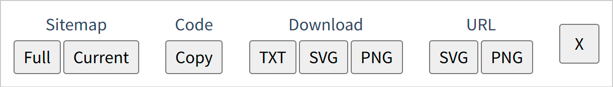

# axure-to-mermaid

This script is designed to be used with [Axure RP](https://axure.com) (a phenomenal wireframing tool) prototypes, when it is run it will copy your published sitemap tree as a mermaid flowchart to your clipboard.

## What is it

This script creates a toolbar with options for generating a [Mermaid flowchart](https://mermaid.js.org/syntax/flowchart.html) from your Axure sitemap with various options for output.

## How to use

I have a pre-generated minified [bookmarklet](/dist/axure-to-mermaid-injected.min.js), just click the bookmarklet to copy your sitemap to the clipboard and paste it into your favorite mermaid editor such as [Mermaid Live Editor](https://mermaid.live/).

## Contact

Brent Morris

Bluesky: [@closetgeekshow.ca](https://bsky.app/profile/closetgeekshow.ca) | Mastodon: [@closetgeekshow@c.im](https://c.im/@Closetgeekshow) | Email: [closetgeekshow@gmail.com](mailto:closetgeekshow@gmail.com)

Project Link: [https://github.com/closetgeekshow/axure-to-mermaid](https://github.com/closetgeekshow/axure-to-mermaid)
