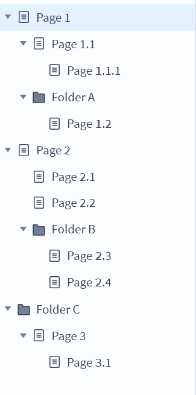

# axure-to-mermaid
## What is it
This script is designed to be used with [Axure RP](https://axure.com) prototypes. It creates a toolbar with options for generating a [Mermaid flowchart](https://mermaid.js.org/syntax/flowchart.html) from your sitemap with various options for output. 

## How to use
### As a bookmarklet
I have a pre-generated minified [bookmarklet](/dist/axure-to-mermaid-injected.min.js), just click the bookmarklet to activate the [toolbar](#features].

### Inside an Axure shape 
> [!NOTE]
> ⚠ Currently broken, trying to figure out why.

Because the bookmarklet is an [IIFE](https://developer.mozilla.org/en-US/docs/Glossary/IIFE), you can trigger it *inside* of a prototype with the **Open Link** action

1. Copy the full [script](/dist/axure-to-mermaid-injected.min.js) to your clipboard
2. Create a new Interaction on a shape, like Click or Load
3. Add an Open Link action 
5. Set **Link to:** Link to external URL and for the value paste in the bookmarklet script
6. Open the page, when you trigger the interaction, the toolbar appears

## Features

* Sitemap
  * Full: generates a markdown text of a flowchart of the entire sitemap tree
  * Current: generates a markdown flowchart using the currently selected page as the root node (Note: there currently is no way to use this button on a folder, that's Future Brent's problem)
* Code
  * Copy - copies the mermaid text to your clipboard
* Download
  * TXT - downloads text file of the mermaid chart
  * SVG - downloads svg file using Mermaid.Ink [**!**](#warning)
  * PNG - downloads png file using Mermaid.Ink [**!**](#warning)
* URL
  * SVG - open svg file in a new tab using Mermaid.Ink [**!**](#warning)
  * PNG - open png file in a new tab using Mermaid.Ink [**!**](#warning)

> [!WARNING]  
> Features that use Mermaid.Ink will send your chart content to a third-party server.
> If you want to keep things entirely private only use the Copy or TXT buttons and generate the chart yourself using [Mermaid.Live](https://mermaid.live/edit), Mermaid CLI or the [Mermaid JS library](https://github.com/mermaid-js/mermaid).

## Example

 
This Axure Sitemap...

 

 

 
becomes this text...

 

 
which Generates this image

 

## "Dependencies"
All dependency scripts are injected from CDN sources to keep bookmarklet at a reasonable size.
* [js-base64](https://github.com/dankogai/js-base64)
* [pako](https://github.com/nodeca/pako)

## Prior art/inspiration
* [@samuei's subgraph technique](https://stackoverflow.com/a/71036087/24246712)
  * I've added styles to make the subgraphs have no visual component beyond structure
* [Mermaid.Ink](https://mermaid.ink) service allows for the generation of mermaid chart images and PDFs with just a URL

## Future Ideas
* Make it work with the Mermaid JS library instead of Mermaid.Ink. I have mermaid chart genereation working in a plugin for myself, I wanted to try to make it work with Mermaid.Ink this time.
* Convert Axure Flowcharts to mermaid (this actually looks pretty easy)
* Label the Mermaid.Ink buttons better or include a warning modal the first time you click one
 
## Contact

Brent Morris

Bluesky: [@closetgeekshow.ca](https://bsky.app/profile/closetgeekshow.ca) | Mastodon: [@closetgeekshow@c.im](https://c.im/@Closetgeekshow) | Email: [closetgeekshow@gmail.com](mailto:closetgeekshow@gmail.com)

Project Link: [https://github.com/closetgeekshow/axure-to-mermaid](https://github.com/closetgeekshow/axure-to-mermaid)